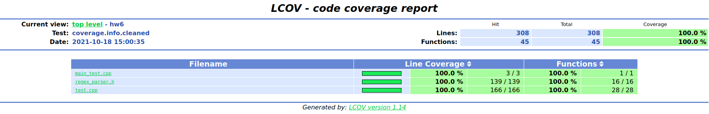

# Compilation

```
mkdir cmake-build-debug
cd cmake-build-debug
cmake ..
make -j5  
```

# Usage

You can include the file `regex_parser.h` and use it in your code. To get an answer, call the function `MaxSubwordInLanguage(regex, word)`.

Also, you can compile the project, run `bin/main`, type a regex, a word and see the answer.

# Tests and code coverage

To run tests, compile the project and run `bin/RunTests`.

The code is 100% covered by tests. To run the code coverage, after the compilation run `make coverage_report` in the same directory. This will create the directory `coverage` and the file `index.html` in it. Open this file to see the code coverage report.



# Description of the algorithm
I solved this task using dynamic programming (dp) on stack. I have stack of `RegexPart`s which correspond to parts of the regex and store dp values:
1. maximum subword of u that is subword of some word in this regex part (`max_subword`)
2. all subwords of u that are prefixes of some word in this regex part (`prefix_subwords`)
3. all subwords of u that are suffixes of some word in this regex part (`suffix_subwords`)
4. all subwords of u that are some word in this regex part (`full_subwords`)

Subwords are stored like pair (i, j) of indexes in word u (i inclusive, j exclusive).

#### Base of dp

For the base we need to calculate dp values for one symbol

- If symbol is 1 then all values are just (0, 0) (empty subwords)
- Otherwise, prefix_subwords, suffix_subwords, and full subwords are just all occurrences of this symbol in u. max_subword is one of these occurrences or (0, 0) (if there are none)

#### Step of dp

Let's look at all operations:

- Concatenation of `a` and `b`
    - max_subword may be either `a.max_subword`, or `b.max_subword`, or maximum concatenation of one of `a.suffix_subwords` and one of `b.prefix_subwords`
    - prefix_subwords are all prefix_subwords of a and all possible concatenations of one of `a.full_subwords` and one of `b.prefix_subwords`
    - likewise, suffix_subwords
    - suffix_subwords are all possible concatenations of one of `a.full_subwords` and `b.full_subwords`
- Addition of `a` and `b`
    - get max_subword of ones of a and b
    - just union other values
- Kleene star of `a`
    - Concatenate `a` to empty word while any value changes. Result will be union of results in all steps.

#### Answer

Answer will be in `max_subword` of the last RegexPart in the stack.

## Asymptotics

O(n), where n is the length of the regex and other values are constant.